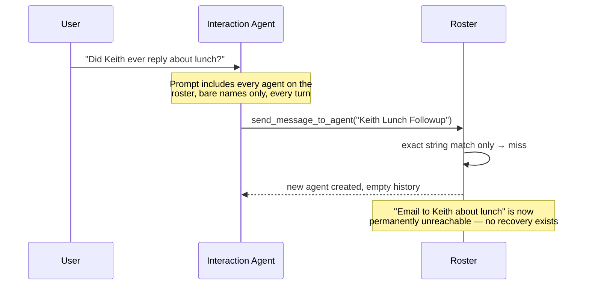
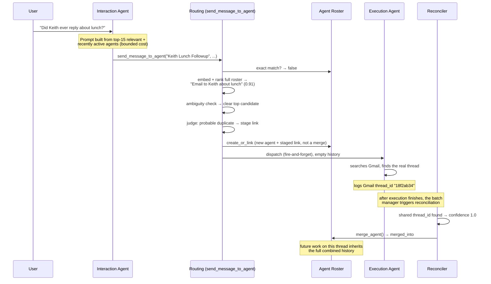

# OpenPoke 🌴

OpenPoke is a simplified, open-source take on [Interaction Company’s](https://interaction.co/about) [Poke](https://poke.com/) assistant—built to show how a multi-agent orchestration stack can feel genuinely useful. It keeps the handful of things Poke is great at (email triage, reminders, and persistent agents) while staying easy to spin up locally.

- Multi-agent FastAPI backend that mirrors Poke's interaction/execution split, powered by [OpenRouter](https://openrouter.ai/).
- Gmail tooling via [Composio](https://composio.dev/) for drafting/replying/forwarding without leaving chat.
- Trigger scheduler and background watchers for reminders and "important email" alerts.
- Next.js web UI that proxies everything through the shared `.env`, so plugging in API keys is the only setup.

---

## Agent overload: what changed

The project's own write-up names this "Execution Agent Overload" as an open
gap: hundreds of execution agents ending up "all competing for the Interaction
Agent's attention." That turned out to be two independent problems — unbounded
prompt cost, and reuse that only ever worked on exact string equality. Full
rationale in [DESIGN.md](DESIGN.md); this section is the visual summary.

### Before



- Every agent rendered into every prompt, bare name only — cost grows
  unbounded with roster size.
- Reuse worked only on exact string equality — any rewording spawned a
  brand-new, disconnected agent.
- A naming miss was final. Nothing tried to reconcile it, ever.

### After



- Prompt capped at 15 relevant + recently active agents, with descriptions —
  bounded cost regardless of roster size.
- A naming miss no longer dead-ends: embeddings plus an LLM judge decide
  whether to stage a hypothesis link.
- Text similarity alone can never merge two agents — only a shared Gmail
  thread id, found after real execution, can. Keeps false merges out.
- Merging is a pointer, not a deletion. Both logs survive, and the surviving
  agent inherits the combined history from then on.

### The agent record itself

The roster used to be a flat `List[str]` — a name and nothing else. Every
other mechanism above needed somewhere to live, so the record grew a schema:

| Field | Before | After |
|---|---|---|
| `name` | the only thing stored | unchanged |
| `description` | — | one-sentence summary of the thread; what the judge and prompt rendering actually match against |
| `embedding` / `embedding_model` | — | the vector used for semantic retrieval, tagged with the model that produced it so a model swap can't silently produce meaningless scores |
| `possible_duplicate_of` | — | a staged hypothesis — `{name, confidence, evidence[]}` — that never triggers a merge on its own |
| `merged_into` | — | set once a real merge commits; the absorbed record and its log file both survive on disk |
| `last_active` | — | drives the recency guarantee in prompt rendering and the archival cutoff |

Nothing here replaced anything — every new field is additive on top of `name`,
which is why the roster's legacy string-list format still loads without
migration (tested directly: `test_legacy_string_list_roster_still_loads`).

### How it was evaluated

Full methodology and every number below in [EVALUATION.md](EVALUATION.md).

**Unit tests — `pytest server/tests`**: 111 tests, deterministic, offline,
under a second, no API key. Covers matching logic, roster state, merging,
concurrency, and every branch of the routing ladder.

**`eval_degradation.py` — does the problem exist, and does the fix solve it?**

| Measured | Old (full roster) | New (capped) |
|---|---|---|
| Prompt tokens at N=200 | 1,576 | 403 (flat regardless of N) |
| Live selection accuracy, N=11 / N=200 | 100% / 94% | 100% / 100% |
| Prompt-render recall @15, real embeddings, N=51 | — | 100% (18/18) |

Accuracy showed no resolvable degradation across the roster sizes actually
tested (up to N=200) — the fix is justified by cost, not accuracy. Nothing
larger than N=200 was measured, so this doesn't rule out degradation past that
point; it only says the dilution-hurts-accuracy hypothesis didn't hold up
within the tested range.

**`eval_agent_matching.py` — is routing correct, end to end?**

| Metric | Result |
|---|---|
| Accuracy / precision / recall / F1 | 100% / 100% / 100% / 1.00 |
| Committed false merges | 0, across every live run |
| Judge consulted | 14 of 17 cases |

[Across ~340 live judgment decisions total, the judge staged 3 bad links in
one batch of 85 and 0 in a rerun of the same size — every one caught by the
evidence gate before it could become a merge.]

**What the 17 cases actually look like.** A handful, to make the numbers
above concrete rather than abstract:

| Type | Request | Should it link? |
|---|---|---|
| Paraphrase | "Check whether Keith ever replied about getting lunch." | Yes — existing "Email to Keith about lunch" agent |
| Typo'd | "Emial to Kieth about lunhc" / "Send Kieth another note about lunhc" | Yes — same agent, despite the typos |
| Pronoun only | "Ask them to raise the equity portion of the offer." | Yes — existing Vercel offer agent, no name mentioned at all |
| Same person, different topic | "Order a birthday gift for Keith Rivera and have it delivered Friday." | **No** — classic false-merge trap; must create new |
| Same company, different matter | "Ask Vercel accounts payable about my outstanding contractor invoice." | **No** — same company as the offer thread, unrelated business |
| Two people, same name, same topic | "Follow up on lunch with Keith," with two Keith-lunch agents already existing | Neither — must hold and ask which one |
| Same setup, surname supplied | "Follow up with Keith Chen about our lunch." | Yes, specifically the Chen one — checks it discriminates rather than freezing whenever names collide |
| Empty roster | "Draft a note to the landlord about the broken heater," no agents exist yet | Creates new |

### Known limitations

Full detail, evidence, and proposed fixes for each in [NOTES.md](NOTES.md),
[DESIGN.md](DESIGN.md), and [EVALUATION.md](EVALUATION.md).

**1. Limitations with our evaluations and testing**

Nothing here ever ran the full pipeline together — a live interaction agent,
real Gmail, real execution agents, all at once. Everything below was tested in
isolated pieces instead:

- Never tested whether a real interaction agent actually reuses names as
  often as we assumed — rendering, routing, and judgment were each tested
  separately, not together.
- Nothing tests real Gmail tool use — whether the execution agent searches
  before acting, in the right order.
- The merge path has never run against real Gmail. Every passing test uses a
  hand-written fake thread ID, not one Gmail actually produced.
- Sample sizes are small — around 340 live decisions, zero false merges. A
  good sign, not proof; a rare failure could simply not have come up yet.
- Results depend on one embedding model and one judge model.

**2. Limitations with our solution**

- Most tunable numbers (how many recent agents to show, how many candidates
  to consider, the ambiguity margin, the archive cutoff) were chosen by
  judgment, not tested against data — and none of it has been validated at
  larger scale or through the full pipeline running end to end.
- Text similarity alone never merges two agents, by design — so a naming
  miss always creates a duplicate, until real Gmail evidence arrives, if it
  ever does.
- Only links the judge actually flags get remembered. 
- Descriptions are frozen at creation, so a thread that changes over months
  keeps its original label.

**3. Gaps in the existing codebase we noticed**

*(beyond "Execution Agent Overload," the gap named in the project's own write-up)*

- The one approval step that exists is a prompt instruction, not an
  enforced control — nothing stops a model from ignoring it.
- Execution history has no length limit — a busy thread just keeps growing
  and gets replayed in full every time it fires.
- A global batch manager can hold a fast agent's reply hostage to a slower
  one — even one from a later, unrelated message.

---

## Requirements
- Python 3.10+
- Node.js 18+
- npm 9+

## Quickstart
1. **Clone and enter the repo.**
   ```bash
   git clone https://github.com/shlokkhemani/OpenPoke
   cd OpenPoke
   ```
2. **Create a shared env file.** Copy the template and open it in your editor:
   ```bash
   cp .env.example .env
   ```
3. **Get your API keys and add them to `.env`:**
   
   **OpenRouter (Required)**
   - Create an account at [openrouter.ai](https://openrouter.ai/)
   - Generate an API key
   - Replace `your_openrouter_api_key_here` with your actual key in `.env`
   
   **Composio (Required for Gmail)**
   - Sign in at [composio.dev](https://composio.dev/)
   - Create an API key
   - Set up Gmail integration and get your auth config ID
   - Replace `your_composio_api_key_here` and `your_gmail_auth_config_id_here` in `.env`
4. **(Required) Create and activate a Python 3.10+ virtualenv:**
   ```bash
   # Ensure you're using Python 3.10+
   python3.10 -m venv .venv
   source .venv/bin/activate
   
   # Verify Python version (should show 3.10+)
   python --version
   ```
   On Windows (PowerShell):
   ```powershell
   # Use Python 3.10+ (adjust path as needed)
   python3.10 -m venv .venv
   .\.venv\Scripts\Activate.ps1
   
   # Verify Python version
   python --version
   ```

5. **Install backend dependencies:**
   ```bash
   pip install -r server/requirements.txt
   ```
6. **Install frontend dependencies:**
   ```bash
   npm install --prefix web
   ```
7. **Start the FastAPI server:**
   ```bash
   python -m server.server --reload
   ```
8. **Start the Next.js app (new terminal):**
   ```bash
   npm run dev --prefix web
   ```
9. **Connect Gmail for email workflows.** With both services running, open [http://localhost:3000](http://localhost:3000), head to *Settings → Gmail*, and complete the Composio OAuth flow. This step is required for email drafting, replies, and the important-email monitor.

The web app proxies API calls to the Python server using the values in `.env`, so keeping both processes running is required for end-to-end flows.

## Project Layout
- `server/` – FastAPI application and agents
- `web/` – Next.js app
- `server/data/` – runtime data (ignored by git)

## License
MIT — see [LICENSE](LICENSE).
