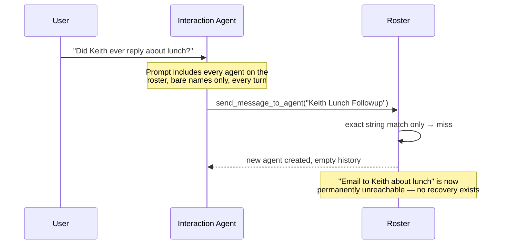
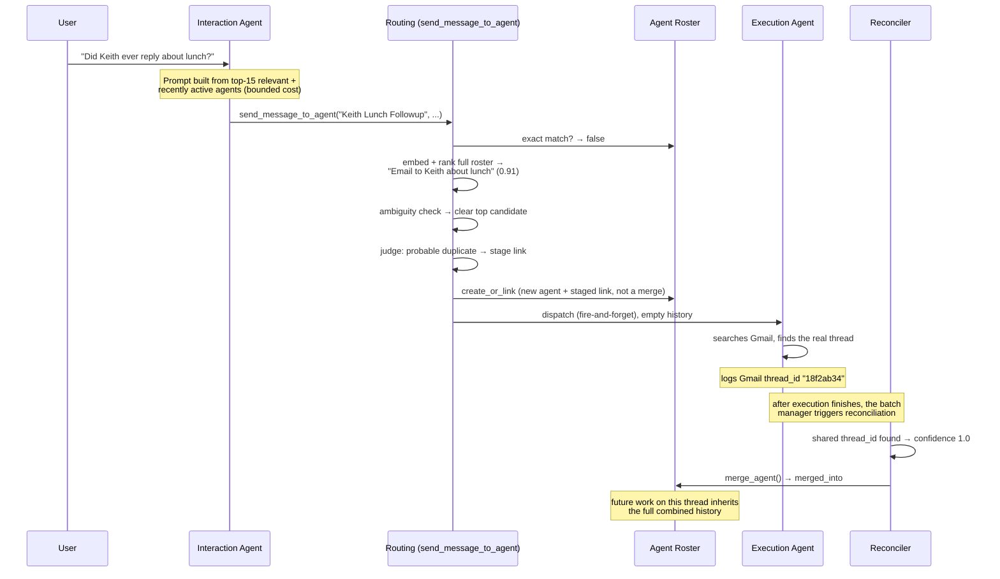

# OpenPoke 🌴

OpenPoke is a simplified, open-source take on [Interaction Company’s](https://interaction.co/about) [Poke](https://poke.com/) assistant—built to show how a multi-agent orchestration stack can feel genuinely useful. It keeps the handful of things Poke is great at (email triage, reminders, and persistent agents) while staying easy to spin up locally.

- Multi-agent FastAPI backend that mirrors Poke's interaction/execution split, powered by [OpenRouter](https://openrouter.ai/).
- Gmail tooling via [Composio](https://composio.dev/) for drafting/replying/forwarding without leaving chat.
- Trigger scheduler and background watchers for reminders and "important email" alerts.
- Next.js web UI that proxies everything through the shared `.env`, so plugging in API keys is the only setup.

---

## Agent overload: what changed

The project's own write-up names "Agent Roster Bloat" as an open gap: hundreds
of execution agents competing for the interaction agent's attention. That
turned out to be two independent problems — unbounded prompt cost, and reuse
that only ever worked on exact string equality. Full rationale in
[DESIGN.md](DESIGN.md); this section is the visual summary.

### Before



- Every agent rendered into every prompt, bare name only — cost grows
  unbounded with roster size.
- Reuse worked only on exact string equality — any rewording spawned a
  brand-new, disconnected agent.
- A naming miss was final. Nothing tried to reconcile it, ever.

### After



- Prompt capped at 15 relevant + recently active agents, with descriptions —
  bounded cost regardless of roster size.
- A naming miss no longer dead-ends: embeddings plus an LLM judge decide
  whether to stage a hypothesis link.
- Text similarity alone can never merge two agents — only a shared Gmail
  thread id, found after real execution, can. Keeps false merges out.
- Merging is a pointer, not a deletion. Both logs survive, and the surviving
  agent inherits the combined history from then on.

### How it was evaluated

Full methodology and every number below in [EVALUATION.md](EVALUATION.md).

**Unit tests — `pytest server/tests`**: 111 tests, deterministic, offline,
under a second, no API key. Covers matching logic, roster state, merging,
concurrency, and every branch of the routing ladder.

**`eval_degradation.py` — does the problem exist, and does the fix solve it?**

| Measured | Old (full roster) | New (capped) |
|---|---|---|
| Prompt tokens at N=200 | 1,576 | 403 (flat regardless of N) |
| Worst-case retrieval margin, N=11 → 200 | 0.870 → 0.000 | — |
| Live selection accuracy, N=11 / N=200 | 100% / 94% | 100% / 100% |
| Prompt-render recall @15, real embeddings, N=51 | — | 100% (18/18) |

Accuracy showed no resolvable degradation at any roster size — the fix is
justified by cost, not accuracy. [The dilution-hurts-accuracy hypothesis was
tested directly and didn't hold up.] The recency guarantee's one live ablation
was inconclusive (survived both with and without it on the one query tested).

**`eval_ablations.py` — does each layer earn its place?**

| Layer removed | Effect | Verdict |
|---|---|---|
| Embeddings (lexical only) | recall 100% → 33% | justified |
| LLM judgment | bad links staged 0 → 2 | justified |
| Retrieval (show everything) | recall 100% → 100% | not justified on recall — cost only |
| Similarity floor | recall 33% → 100% (floor was *hurting*) | floor was harmful — dropped to 0.20 |
| Evidence gate | caught 3 bad links in one run, 0 in a rerun | insurance; not yet proven necessary on this scale of traffic |

[Similarity floor was recalibrated from 0.60 down to 0.20 after a second
dataset showed the higher value was actively cutting recall — full story in
DESIGN.md.]

**`eval_agent_matching.py` — is routing correct, end to end?**

| Metric | Result |
|---|---|
| Accuracy / precision / recall / F1 | 100% / 100% / 100% / 1.00 |
| Committed false merges | 0, across every live run |
| Exact-match-only baseline | 0% recall on the same cases |
| Judge consulted | 14 of 17 cases |

[Across ~340 live judgment decisions total, the judge staged 3 bad links in
one batch of 85 and 0 in a rerun of the same size — every one caught by the
evidence gate before it could become a merge.]

### Known limitations

Full detail, evidence, and proposed fixes for each in [NOTES.md](NOTES.md).

- **Prompt injection** — untrusted email content reaches an agent holding
  send-capable Gmail tools; nothing sanitizes it. Highest severity, not
  mitigated.
- **Unbounded per-agent context** — a busy or merged agent's history grows
  without limit; nothing summarizes it.
- **No approval gate on irreversible actions** — sending or forwarding email
  has no human-in-the-loop check.
- **Recovery from a naming miss is incidental, not guaranteed** — a new agent
  has no idea it might be a duplicate, and the resume-after-clarification flow
  is only verified for exact string reproduction, not a close paraphrase.
- **The core cost/reuse claim was never tested against a real interaction
  agent end to end** — every underlying piece (rendering, routing, judgment)
  was tested individually; the full pipeline wasn't, for lack of time.
- **Two pre-existing issues carried forward** — a global batch manager can
  hold a fast agent's reply hostage to a slow one in the same batch, and
  roster writes aren't safe across multiple server processes.
- **Coverage stops at "is the logic correct," not "does the agent behave
  correctly"** — nothing exercises real Gmail tool-use trajectories or
  end-to-end outcomes, and a real Gmail merge has never been run.

---

## Requirements
- Python 3.10+
- Node.js 18+
- npm 9+

## Quickstart
1. **Clone and enter the repo.**
   ```bash
   git clone https://github.com/shlokkhemani/OpenPoke
   cd OpenPoke
   ```
2. **Create a shared env file.** Copy the template and open it in your editor:
   ```bash
   cp .env.example .env
   ```
3. **Get your API keys and add them to `.env`:**
   
   **OpenRouter (Required)**
   - Create an account at [openrouter.ai](https://openrouter.ai/)
   - Generate an API key
   - Replace `your_openrouter_api_key_here` with your actual key in `.env`
   
   **Composio (Required for Gmail)**
   - Sign in at [composio.dev](https://composio.dev/)
   - Create an API key
   - Set up Gmail integration and get your auth config ID
   - Replace `your_composio_api_key_here` and `your_gmail_auth_config_id_here` in `.env`
4. **(Required) Create and activate a Python 3.10+ virtualenv:**
   ```bash
   # Ensure you're using Python 3.10+
   python3.10 -m venv .venv
   source .venv/bin/activate
   
   # Verify Python version (should show 3.10+)
   python --version
   ```
   On Windows (PowerShell):
   ```powershell
   # Use Python 3.10+ (adjust path as needed)
   python3.10 -m venv .venv
   .\.venv\Scripts\Activate.ps1
   
   # Verify Python version
   python --version
   ```

5. **Install backend dependencies:**
   ```bash
   pip install -r server/requirements.txt
   ```
6. **Install frontend dependencies:**
   ```bash
   npm install --prefix web
   ```
7. **Start the FastAPI server:**
   ```bash
   python -m server.server --reload
   ```
8. **Start the Next.js app (new terminal):**
   ```bash
   npm run dev --prefix web
   ```
9. **Connect Gmail for email workflows.** With both services running, open [http://localhost:3000](http://localhost:3000), head to *Settings → Gmail*, and complete the Composio OAuth flow. This step is required for email drafting, replies, and the important-email monitor.

The web app proxies API calls to the Python server using the values in `.env`, so keeping both processes running is required for end-to-end flows.

## Project Layout
- `server/` – FastAPI application and agents
- `web/` – Next.js app
- `server/data/` – runtime data (ignored by git)

## License
MIT — see [LICENSE](LICENSE).
